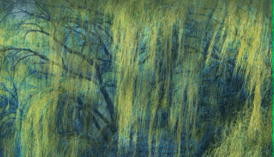

# v-progressive-image

##### 这是一个适用于vue3的图片渐进式加载插件！

<a href="https://www.npmjs.com/package/v-progressive-image"></a>

### 效果



### 简介

v-progressive-image 是vue3的指令插件，通过两个指令，即可实现图片渐进加载功能。

v-progressive-image 可以帮您：实现从高斯模糊的缩略图到原图的平缓过渡，改善用户体验。

### 安装插件

```
npm i v-progressive-image
```

### 全局引入插件

```javascript
import 'v-progressive-image/lib/index.css';  // 引入样式文件
import vProgressiveImage from 'v-progressive-image';
```

```javascript
app.use(vProgressiveImage, {
	removePreview: false, // 默认false 大图加载完成后是否删除较小的预览图(需要进行DOM操作)
  animation: true // 默认true 是否启用过渡动画
});
```

### 使用

```vue
    <div
      v-preview="'https://ftp.bmp.ovh/imgs/2021/04/c7a9451f12cb70ce.jpg'"
      v-origin="'https://ftp.bmp.ovh/imgs/2021/04/b3a70da0fa596920.jpeg'"
    >
    </div>
```

- 使用 `v-preview` 指令指定预览图（较小的图片）链接，使用 `v-origin` 指令指定原图链接。
- div标签中间不可以有内容。
- 预览图建议使用Base64编码。