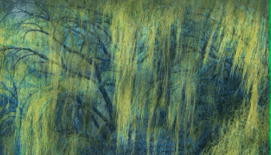

# vue-emage

### 效果



### 简介

vue-emage 即 Evolution Image，可以“进化”的图片。

##### 这是一个适用于vue3的图片渐进式加载插件！

vue-emage可以帮您：实现从缩略图到原图的平缓过渡，改善用户体验。

### 安装插件

```
npm i vue-emage
```

### 全局引入插件

```javascript
import 'vue-emage/lib/index.css';  // 引入样式文件
import vueEmage from 'vue-emage';
```

```javascript
app.use(vueEmage, {
	removePreview: false // 大图加载完成后是否删除较小的预览图(需要进行DOM操作)
});
```

### 使用

```vue
    <div
      v-preview="'https://ftp.bmp.ovh/imgs/2021/04/c7a9451f12cb70ce.jpg'"
      v-origin="'https://ftp.bmp.ovh/imgs/2021/04/b3a70da0fa596920.jpeg'"
    >
    </div>
```

使用 `v-preview` 指令指定预览图（较小的图片）链接，使用 `v-origin` 指令指定原图链接。